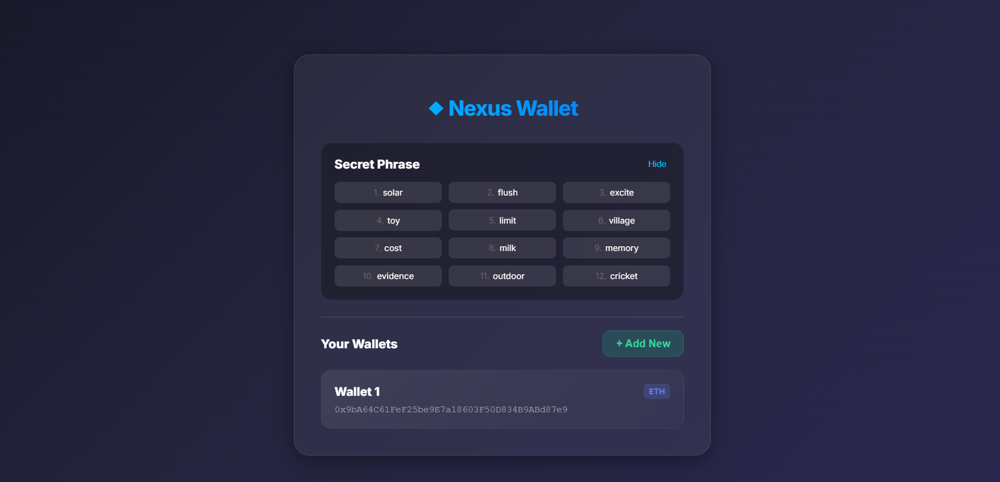

# 💎 Nexus Wallet

### A modern, Web3-native HD Wallet Generator built with React & Ethers.js

[**View Live Demo**](https://imattri28.github.io/nexus-wallet).

## 📋 Overview

Nexus Wallet is a hierarchical deterministic (HD) wallet dashboard. It demonstrates the core cryptography behind modern crypto wallets (like MetaMask or Ledger).

Unlike basic wallet generators, this project implements **BIP-39** mnemonic generation and **BIP-44** derivation paths, allowing users to generate a single "Master Seed" and derive infinite public Ethereum addresses from it.

## ✨ Features

* **🔐 Secure Seed Generation:** Generates a cryptographically secure 12-word mnemonic phrase using `ethers.js`.
* **🌳 HD Key Derivation:** Implements the standard Ethereum derivation path (`m/44'/60'/0'/0/x`) to generate multiple accounts from one root.
* **🛡️ Privacy First:** Includes a "Show/Hide" security toggle for the recovery phrase.
* **🎨 Glassmorphism UI:** A fully responsive, modern interface featuring frosted glass effects and animated gradients.
* **⚡ Real-time Feedback:** Instant wallet generation without page reloads.

## 🛠️ Tech Stack

* **Frontend Library:** React.js (Create React App)
* **Blockchain Logic:** Ethers.js (v6)
* **Styling:** CSS3 (Custom Glassmorphism & Keyframe Animations)
* **Deployment:** GitHub Pages

## 🚀 How to Run Locally

If you want to view the source code or contribute, follow these steps:

1.  **Clone the repository**
    ```bash
    git clone [https://github.com/imattri28/nexus-wallet.git](https://github.com/imattri28/nexus-wallet.git)
    cd nexus-wallet
    ```

2.  **Install Dependencies**
    ```bash
    npm install
    ```

3.  **Start the Server**
    ```bash
    npm start
    ```
    Open [http://localhost:3000](http://localhost:3000) to view it in your browser.

## 🧠 Technical Highlights

### Solving the "Depth 5" Derivation Issue
One of the key technical challenges in this project was handling Ethers.js v6 `HDNodeWallet` behavior. 

By default, creating a wallet from a phrase often returns a child node (Depth 5). This project explicitly implements **Manual Seed Generation** to ensure we always start from the Root Node (Depth 0):

```javascript
// Explicitly computing the seed ensures we get the Root Node (Depth 0)
// allowing for proper child derivation.
const mnemonicObj = Mnemonic.fromPhrase(mnemonic);
const seed = mnemonicObj.computeSeed();
const rootNode = HDNodeWallet.fromSeed(seed);

🤝 Contributing
Contributions, issues, and feature requests are welcome!

Fork the Project

Create your Feature Branch (git checkout -b feature/AmazingFeature)

Commit your Changes (git commit -m 'Add some AmazingFeature')

Push to the Branch (git push origin feature/AmazingFeature)

Open a Pull Request

📄 License
Distributed under the MIT License. See LICENSE for more information.

Built with ❤️ by imattri28
